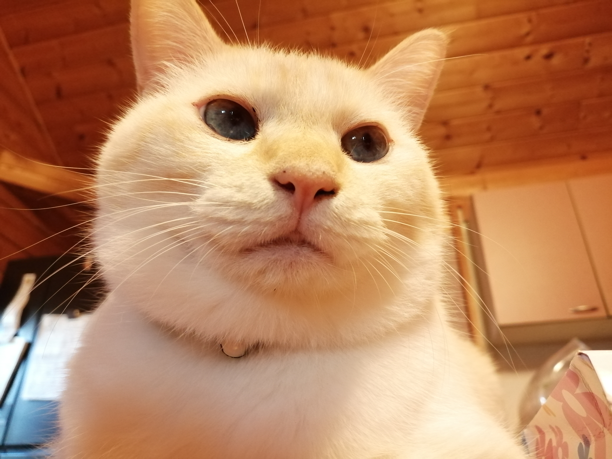

# Profile
- マシュー
- 鹿児島県
- ジグソーパズル、切り絵
# dream
- 10000ピースのジグソーパズルを作ること
- Androidアプリを作ること
# Skills
- HTML,JavaScript,CSS

# History
- 2019年 角川ドワンゴ学園 [N高等学校](https://nnn.ed.jp/) 入学
- 12月中旬　レポートが終わったので入門コースをはじめる
- 1月19日　

<iframe width="560" height="315" src="https://www.youtube.com/embed/-kgOFJG881I" frameborder="0" allow="accelerometer; autoplay; encrypted-media; gyroscope; picture-in-picture" allowfullscreen></iframe>

